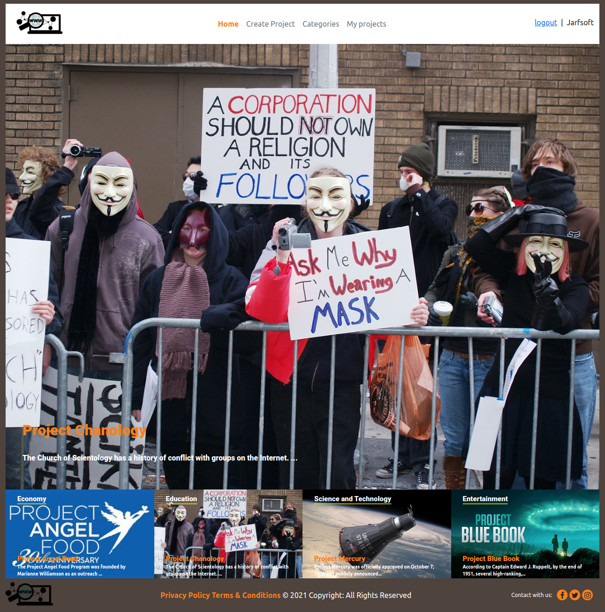

# Ruby on Rails Article-page

> This website was developed as the capstone project for Ruby on Rails. It is a platform that can be used to post ideas for projects and attach an image to it. On the main page you can find the most voted project and below the most recent projects of each category placed in order of priority from left to right. A list of all projects created by the user can be found in a link that says "My Projects". With the "Categories" link, a list of all categories will be displayed with a thumbnail of the last added project. Choosing one will display a list of all projects assigned to the category.

> The MVC concepts of RoR have been used to provide functionality.




## Live Demo

[Demo](https://jarfsoft-article-page.herokuapp.com/)


### Built With

- Ruby
- Ruby on Rails 6
- Bootstrap
- Rubocop
- Visual Studio Code
- Linux
- Rspec
- Cloudinary

### Setup

- Clone or download the project to your local machine. If necessary, unzip the file.

- Change to the project's root directory
```
cd Article-page
```

- Install the required gems
```
bundle install
```

- Setup the database
```
rails db:create
rails db:migrate
```

- Start up the Rails server
```
rails server
```

- Open your browser and access your app on the address

NOTE: You need to have `Bundler` installed and, of course, `Ruby`. If don't have `Bundler` installed you can install it with `gem install bundler`.

Assuming that `Bundler` is installed, you can continue with the following steps:
- Step 1: Clone this repository. Just use: `git clone git@github.com:Jarfsoft/Article-page.git`.
- Step 2: Open the project folder where the repository was downloaded. Once you are in that folder, open a terminal and make sure that it will be opened in that specific folder.
- Step 3: Once you are in the terminal, just type in: `bundle install`. This will install the required dependencies for this project.
- Step 4: Type in `rails webpacker:install` to avoid a webpacker:manifest error while trying to run the project.
- Step 5: Now, you need to run the migrations. To do this, while in the project root folder type in: `rails db:migrate`.
- Step 6: Now, to try the project type in: `rails console`. You can add Users, Posts and Comments in hash form. Remember to take into account the restrictions in place for each model. You can check them out in *app/models*.

### Authors

👤 **Juan Raudales**

- Github : [@Jarfsoft](https://github.com/Jarfsoft)
- Twitter : [@Jarfsoft](https://twitter.com/Jarfsoft)
- Linkedin : [Jarfsoft](https://www.linkedin.com/in/juan-raudales-flores/)


### 🤝 Contributing

Contributions, issues and feature requests are welcome!

Feel free to check the [issues page](issues/).

### Show your support

Give a ⭐️ if you like this project!


### 📝 License

This project is for microverse course purposes.

## Acknowledgements

- [Design](https://www.behance.net/gallery/14554909/liFEsTlye-Mobile-version) by [Nelson Sakwa](https://www.behance.net/sakwadesignstudio)
